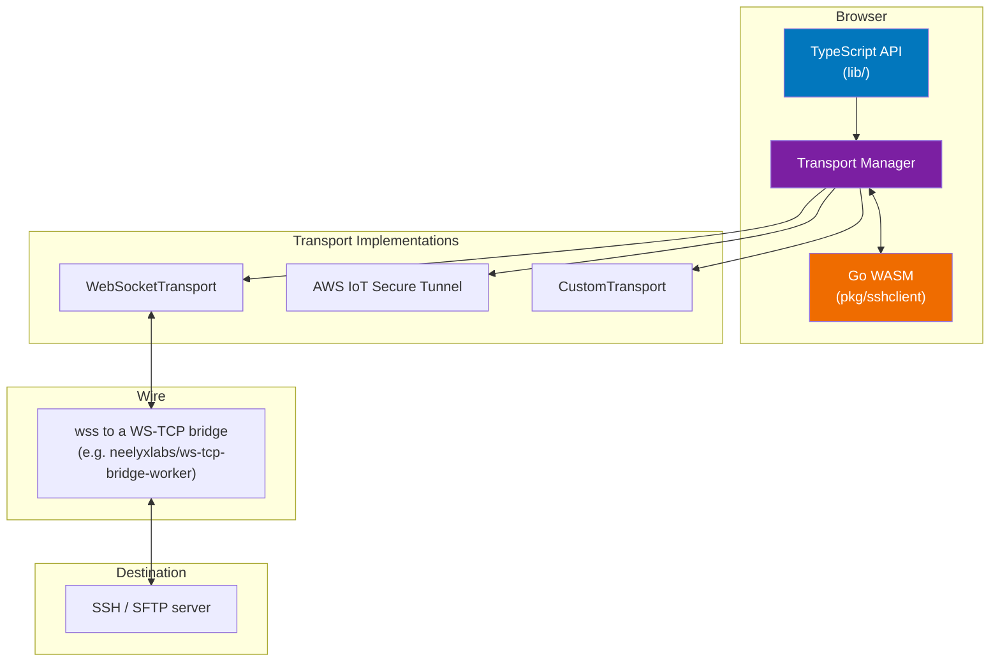

# sshclient-sftp-wasm — CLAUDE.md

This is a **fork** of [VerdigrisTech/sshclient-wasm](https://github.com/VerdigrisTech/sshclient-wasm) extended with:

- **SFTP support** (`pkg/sshclient/sftp.go`, `lib/sftp.ts`) via `github.com/pkg/sftp`.
- **Mandatory host-key pinning** — `ssh.InsecureIgnoreHostKey()` is removed; callers MUST supply a `HostKeyPin` with a SHA256 fingerprint.
- **PuTTY PPK detection** — pasting a `.ppk` private key produces a typed `PPKFormatError` with conversion guidance before any network I/O.
- **Typed errors with stable codes** (`host-key-mismatch`, `auth-failed`, `ppk-not-supported`, etc.) surfaced both in Go (`ConnectError`) and TypeScript.

See `UPSTREAM.md` for the fork SHA, rebase checklist, and divergence summary.

## Scope boundary (important)

This library is **general-purpose**. Public API speaks in primitives only: hostnames, ports, credentials, `Uint8Array`, `HostKeyPin`, `Transport` interfaces. No domain-specific concepts belong in this codebase.

## Architecture



**Key insight**: browsers can't open raw TCP. A transport (typically `WebSocketTransport`) is always pointed at a bridge that translates WS↔TCP. The bridge can be chisel-on-a-container, AWS IoT Secure Tunneling, or a Cloudflare Worker using `cloudflare:sockets`. The library itself is transport-agnostic.

## Tech stack

- **Go** 1.24+ (WASM target)
- **TypeScript** 5.5+
- **Node** 22+, **pnpm** 10+
- **Build**: `make wasm` for the binary; `pnpm run build:ts` for the TS wrapper.
- **Test**: `make test` (runs `go test` + `pnpm test:run`).

## Project layout

This repo ships a single artifact: the `@neelyxlabs/sshclient-sftp-wasm` npm package. The companion WS-TCP bridge (a Cloudflare Worker that browser clients connect through) lives in a separate repo: [neelyxlabs/ws-tcp-bridge-worker](https://github.com/neelyxlabs/ws-tcp-bridge-worker). The bridge is protocol-agnostic and independently useful; keeping it separate gives it its own issue tracker, stars, and discoverability for non-SSH use cases.

```
main.go                   // JS bindings (connect, send, disconnect, ...)
sftp_bindings.go          // SFTP JS bindings + errorToJS helper
pkg/sshclient/
  client.go               // SSH client + host-key pinning + PPK detection
  sftp.go                 // SFTP session (PutFile atomic rename, MkdirAll, Close)
  transport.go            // Transport interface + JSTransport
  interceptor.go          // packet interception
  client_test.go          // unit tests for host-key / PPK / error classification
  sftp_test.go            // unit tests for SFTP (in-memory sftp.NewServer)
lib/
  index.ts                // SSHClient class + connect/getServerFingerprint
  sftp.ts                 // SFTPHandle
  errors.ts               // typed error classes + wrapSSHError
  transport.ts            // WebSocketTransport + CustomTransport
  aws-iot-tunnel.ts       // AWS IoT Secure Tunneling transport
  ...                     // framework shims (next, react, vite)
test/integration/         // docker-compose (openssh) + Playwright; exercises library + bridge
.github/workflows/
  ci.yml                  // go tests + wasm compile-check + TS build/test
  release.yml             // npm publish on tag v*
Makefile                  // build, test, wasm, wasm-check targets
package.json              // @neelyxlabs/sshclient-sftp-wasm
UPSTREAM.md               // fork SHA + rebase checklist
```

## Public API (do NOT break without a major version bump)

### TypeScript (npm `@neelyxlabs/sshclient-sftp-wasm`)

```ts
import {
  SSHClient,              // static methods: initialize, connect, getServerFingerprint
  SSHSession,             // returned by connect(); has sftpOpen()
  SFTPHandle,             // returned by sftpOpen(); has put, mkdir, close
  WebSocketTransport,
  CustomTransport,
  HostKeyPin,
  // Typed errors
  HostKeyPinRequiredError,
  HostKeyMismatchError,
  PPKFormatError,
  InvalidPrivateKeyError,
  AuthFailedError,
  TransportError,
  InternalSSHError,
} from "@neelyxlabs/sshclient-sftp-wasm";
```

### Go

`pkg/sshclient` is an internal implementation detail — consumers interact via the JS bindings, not the Go API. Go-level callers (e.g. unit tests) use `Client`, `ConnectionOptions`, `HostKeyPin`, `ConnectError`.

## Common tasks

- **Add a new JS binding**: add a `js.FuncOf` function in `sftp_bindings.go` (or `main.go` for non-SFTP); register it in `main.go`'s `main()` map; update `lib/index.ts` or `lib/sftp.ts`.
- **Add a new error type**: add the `ConnectErrorCode` constant in `client.go`; handle it in `errorToJS` in `sftp_bindings.go` if context fields are needed; add a typed class in `lib/errors.ts` + map in `wrapSSHError`.
- **Rebase upstream**: follow `UPSTREAM.md` checklist.
- **Publish a new version**: bump `package.json` version; tag `v<version>` on `main`; the release workflow publishes.

## Testing discipline

- Every new Go function gets a test in `*_test.go`. Go tests run against native (non-WASM) builds because `pkg/sftp` and `x/crypto/ssh` client APIs compile for both targets.
- Every WASM-only change must pass `make wasm-check` before merging.
- End-to-end behavior (real network path including the bridge) is covered by `test/integration/` — these run in CI on every PR.
